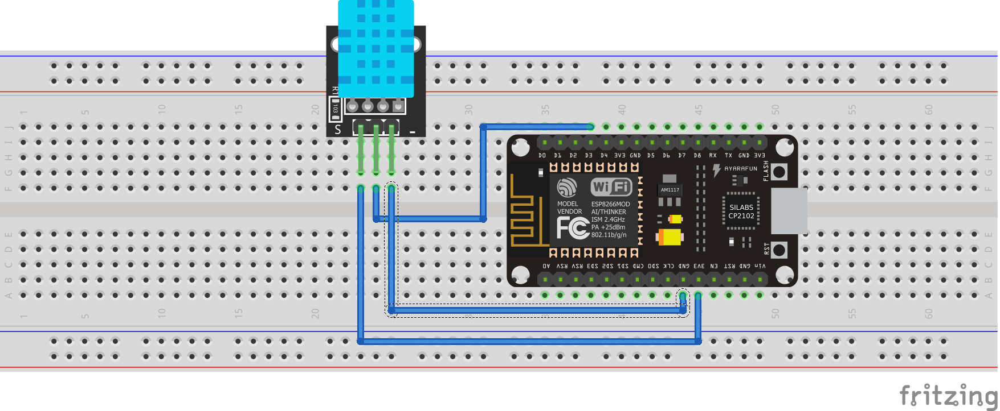
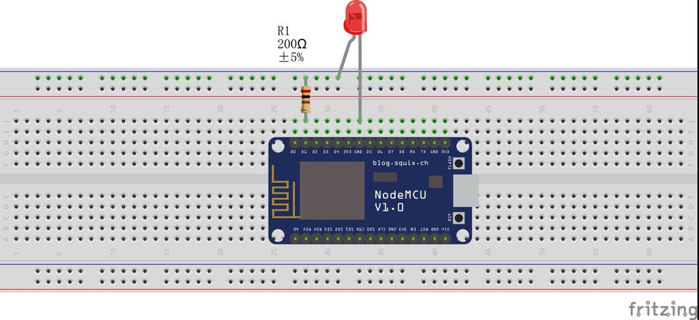
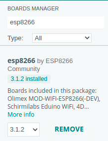
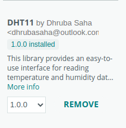
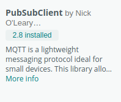
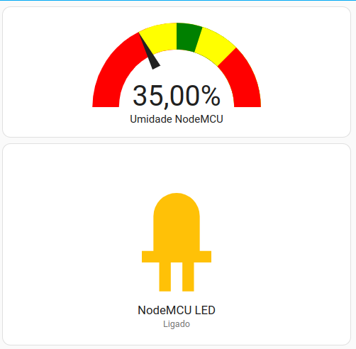
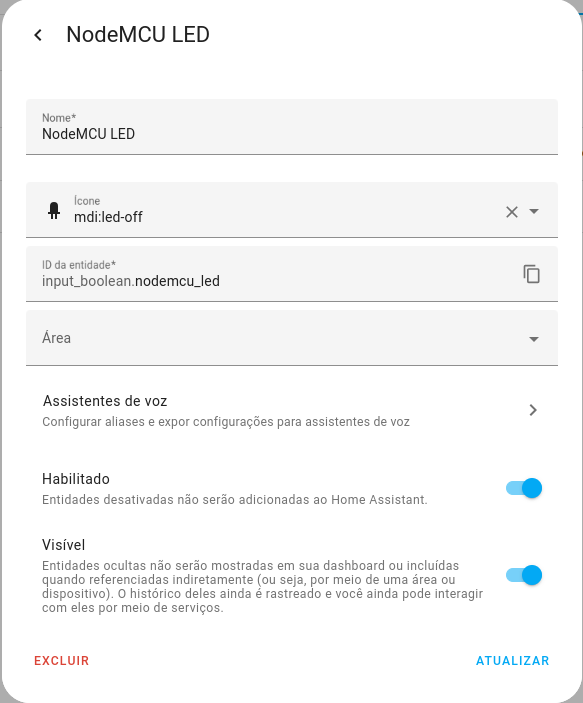
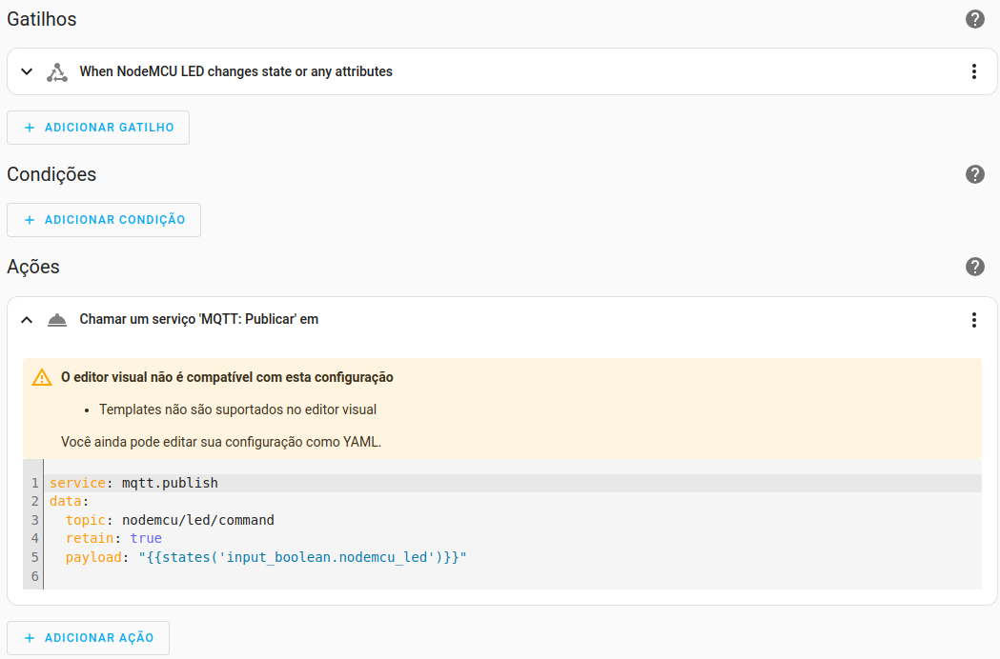
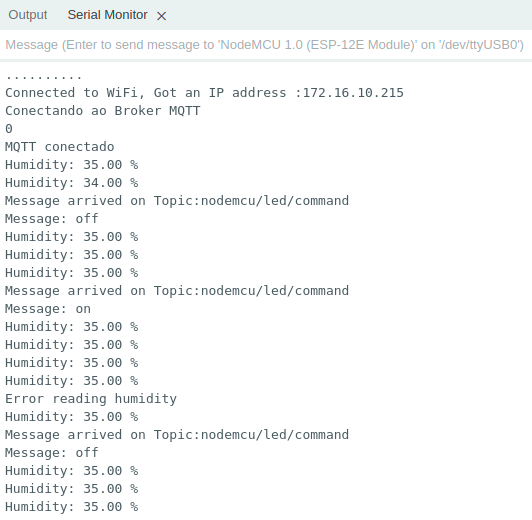

<td style="width: 20%;"></td>

# Índice

- [Introdução](#Introdução)
- [Funções dos pinos do NodeMCU ESP12](#Funções-dos-pinos-do-NodeMCU-ESP12)
- [Drives](#Drives)
- [Setup](#setup)
- [NodeMCU e MQTT](#NodeMCU-e-MQTT)
- [Sites relacionados ao Home Assistant, NodeMCU com MQTT](#Sites-relacionados-ao-Home-Assistant,-NodeMCU-com-MQTT)
- [Status](#status)

# Introdução

O NodeMCU é uma placa de desenvolvimento baseada no ESP8266 com conectividade Wi-Fi e GPIOs, ideal para projetos de IoT. O Home Assistant é uma plataforma de automação residencial de código aberto que oferece uma interface centralizada para controlar dispositivos e serviços. Integrando o NodeMCU com o Home Assistant, é possível criar dispositivos personalizados e usar o Home Assistant para controlar e monitorar esses dispositivos. Isso permite criar automações sofisticadas e personalizadas para tornar a casa mais inteligente e conveniente, usando o NodeMCU para interagir com sensores e atuadores e o Home Assistant para gerenciar toda a automação.

# Funções dos pinos do NodeMCU ESP12

Principais características da placa:


Todos os pinos GPIOs, podem ser entradas ou saídas dependendo da configuração dos mesmos. Não ultrapasse a corrente de 12 mA em cada porta dessas, pois poderá danificar o chip. O recomendado é 6 mA. O nível de tensão a ser usado nessas portas não deverá ultrapassar os 3,3V. Se for necessário conectar o NodeMCU à outro dispositivo de tensão maior, como um Arduino ou módulos de 5V, use conversores bidirecionais de tensão como o do link abaixo ou use divisores resistivos de tensão.
O NodeMCU ESP12 tem duas fileiras de 15 pinos (total 30 pinos). A distância entre as duas fileiras é grande (2,30 cm), mas poderá inseri-lo em um Protoboard padrão. Os pinos RESERVED não deverão ser usados, como o nome já diz, são reservados.

    VIN – Esse é o pino de alimentação externa ( recomendo 5,0V / 1A). Pode usar até 9V, mas o regulador da placa deverá esquentar. Não use-o se estiver usando a USB.
    GND– Esse é o terra da placa. Não se esqueça de conectá-lo ao terra de outros dispositivos.
    RST – Reset do módulo ESP-12. Nível LOW(0V) dá um reboot na placa.
    EN – (Enable) ativa o módulo ESP-12 quando o nível for HIGH(3,3V).
    3.3V – saída do regulador interno 3,3V – Para alimentar outro dispositivo, não use mais do que 500 mA de corrente.
    CLK – interface SPI (clock) – pino SCLK (GPIO_6)
    SD0 – interface SPI (master in serial out) – pino MISO (GPIO_7)
    CMD – interface SPI (chip select) – pino CS (GPIO_11)
    SD1 –  interface SPI (master out serial in) – pino MOSI (GPIO_8)
    SD2 – pino GPIO_9 pode ser usado também para comunicação com SD Card (SDD2)
    SD3 – pino GIPO_10 – pode ser usado também para comunicação com SD Card (SDD3)
    RSV – reservado (não use).
    ADC0– pino de entrada do conversor analógico digital ADC de 10 bits. Tensão máxima de 1,1V (variação do valor digital – 0 a 1024).
    D0 – pino GIPO_16 pode ser usado para acordar (WAKE UP) o ESP8266 em modo sono profundo (Deep sleep mode).
    D1 – pino GPIO_5 – entrada ou saída.
    D2 – pino GIPO_4 – entrada ou saída.
    D3 – pino GPIO_0 é usado também para controlar o upload do programa na memória Flash. Esta conectado no botão FLASH.
    D4 – pino GPIO_2 – UART_TXD1 quando carregando o programa na memória FLASH
    D5 – pino GPIO_14  pode ser usado em SPI de alta velocidade (HSPI-SCLK)
    D6 – pino GPIO_12  pode ser usado em SPI de alta velocidade (HSPI-MISO)
    D7 – pino GPIO_13  pode ser usado em SPI de alta velocidade (HSPI-MOSI) ou UART0_CTS.
    D8 – pino GPIO_15  pode ser usado em SPI de alta velocidade (HSPI-CS) ou UART0_RTS.
    RX – pino GPIO_3 – U0RXD quando carregando o programa na memória FLASH.
    TX – pino GIPO_1 – U0TXD quando carregando o programa na memória FLASH.


# Drives

<ul>
<li>https://www.nodemcu.com/index_en.html </li>
<li>https://github.com/nodemcu/nodemcu-firmware</li>
<li>https://github.com/nodemcu/nodemcu-devkit-v1.0</li>
</ul>

# NodeMCU e MQTT

MQTT com NodeMCU e Home Assistant
Embora o NodeMCU possuir um chip com desempenho superior à maioria dos chips disponíveis no mercado para a mesma finalidade, ele ainda é um processador bastante limitado e precisa trabalhar com protocolos leves, como o MQTT, para fornecer um desempenho satisfatório.

A configuração do broker para a arquitetura publish-subscribe e o uso do MQTT requerem apenas a instalação de um servidor MQTT. Com um broker devidamente instalado, os tópicos aos quais os sensores e atuadores publicam e se inscrevem serão criados e apagados dinamicamente, de acordo com o seu uso e configuração. Atualmente, há vários servidores MQTT de código aberto no mercado, o Mosquitto, da Eclipse Foundation será utilizado no Home Assistant.

Para gerenciar os objetos conectados ao broker e as conexões, pacotes de controle são transmitidos pela rede. Através desses pacotes, é garantido que todas as mensagens enviadas cheguem ao broker e torna-se possível estabelecer níveis de QoS (Quality of Service). Os principais pacotes trafegados entre os objetos são:

<ul>
<li>CONNACK: Reconhecimento da solicitação de conexão.</li>
<li>PUBLISH: Enviado pelo cliente para o broker, publicando uma mensagem.</li>
<li>PUBACK: Reconhecimento da solicitação de publicação.</li>
<li>PUBREC: Publicação recebida. QoS 0: a mensagem não é armazenada. A mensagem é entregue no máximo uma vez ou não é entregue. Pode ser perdida se o cliente for desconectado ou se o servidor falhar.</li>
<li>PUBREL: Publicação publicada. QoS 1: modo de transferência padrão. A mensagem é sempre entregue pelo menos uma vez. Se o emissor não receber uma confirmação, a mensagem será enviada novamente.</li>
<li>PUBCOMP: Publicação completada. QoS 2: a mensagem é sempre entregue exatamente uma vez e é armazenada localmente no emissor e no receptor até ser processada.</li>
<li>SUBSCRIBE: Enviado para se inscrever em determinado tópico.</li>
<li>SUBACK: Reconhecimento da inscrição.</li>
<li>UNSUBSCRIBE: Enviado para cancelar a inscrição em determinado tópico.</li>
<li>UNSUBACK: Reconhecimento do cancelamento de inscrição.</li>
<li>DISCONNECT: Enviado para se desconectar do broker.</li>
</ul>

Para facilitar a utilização do protocolo MQTT com o NodeMCU, existe a biblioteca de código aberto "PubSubClient". Com essa biblioteca, é possível trocar mensagens MQTT com um broker de forma simplificada. Além do MQTT, existem outras bibliotecas de código aberto que ajudam a tratar e implementar os protocolos necessários para conectar e aumentar a precisão do sensoriamento do NodeMCU. Algumas das bibliotecas amplamente utilizadas e em constante produção incluem: ESP8266WiFi, WiFiManager, ArduinoOTA e Bounce2

## MQTT Discovery no Home Assistant

Home Assistant permite a descoberta automatica de dispositivos comunicando via MQTT sem a necessidade de cadastro prévio através do MQTT discovery. Isso permite a utilização de dispositivos MQTT com um esforço mínimo de configuração, sendo esta efetuada no próprio dispositivo e no tópico utilizado pelo dispositivo. Para evitar múltiplas entradas idênticas se um dispositivo se voltar a ligar, um identificador único é aplicado a cada dispositivo.

Para criar um dispositivo no Home Assistant via MQTT discovery, são necessários apenas 2 publicações em tópicos no MQTT por parte do dispositivo:

1. **Mensagem de configuração:** Publicada num tópico de configuração, contém o tipo de dispositivo necessário (**device_class**), identificador único (**unique_id**), tópico onde as atualizações de valores serão realizadas (**state_topic**) e o restante da configuração do dispositivo. O tópico da mensagem de configuração precisa seguir o seguinte formato:

   **<span style="color:green">\<discovery_prefix\>/</span><span style="color:red">\<component\>/</span><span style="color:yellow">[\<node_id\>/]</span><span style="color:dodgerblue">\<object_id\>/</span>config**

   - **<span style="color:green">\<discovery_prefix\>/</span>**: O prefixo de descoberta predefinido é **<span style="color:green">homeassistant</span>**. Este prefixo pode ser alterado.
   - **<span style="color:red">\<component\>/</span>**: Uma das integrações MQTT suportadas, como **<span style="color:red">sensor</span>** ou **<span style="color:red">binary_sensor</span>**.
   - **<span style="color:yellow">[\<node_id\>/]</span>**(Opcional): ID do nó que fornece o tópico, não é utilizado pelo Home Assistant mas pode ser utilizado para estruturar o tópico MQTT. O ID do nó deve consistir apenas em caracteres da classe de caracteres [a-zA-Z0-9_-] (alfanuméricos, sublinhado e hífen).
   - **<span style="color:dodgerblue">\<object_id\>/</span>**: A ID do dispositivo. Isto serve apenas para permitir tópicos separados para cada dispositivo e não é utilizado para o entity_id. O ID do dispositivo deve consistir apenas em caracteres da classe de caracteres [a-zA-Z0-9_-] (alfanuméricos, sublinhado e hífen).

   Exemplo para criar um sensor de umidade utilizando o comando mosquitto_pub na linha de comando do Linux para publicar num tópico MQTT no formato mencionado acima:
   - mosquitto_pub -h 172.16.10.169 -p 1883 -u mqttUser -P senha -m '{"unique_id":"umiidade_cozinha_1","device_class":"humidity","unit_of_measurement":"%","name":"Umidade Cozinha 1","state_topic":"umidade1/cozinha/state"}' -t homeassistant/sensor/umidade/cozinha/config -r

2. **Mensagem de atualização:** Publicada no tópico informado na mensagem de configuração, contém o valor enviado pelo dispositivo ao Home Assistant.

   Exemplo para publicar o valor de umidade do sensor:
   - mosquitto_pub -h 172.16.10.169 -p 1883 -u mqttUser -P senha -t "umidade1/cozinha/state" -m 58.73


# Arduino IDE

Uma das grandes vantagens do NodeMCU é que ele funciona como se fosse um arduino e pode ser programado utilizando a mesma IDE. O tutorial a seguir ensina o passo-a-passo de como programar o NodeMCU utilizando a IDE do Arduino no Windows ou Linux:

[Guia NodeMCU – ESP12 – Usando Arduino IDE](http://blog.eletrogate.com/nodemcu-esp12-usando-arduino-ide-2/)

# Aplicação: Sensor de Umidade DH11 e LED.

As imagens abaixo mostram exemplos de ligação de um sensor de umidade DH11 e um LED ao NodeMCU. Neste exemplo, será feito um programa que irá ler o valor fornecido pelo sensor de umidade e enviar este valor para o Home Assistant via MQTT utilizando MQTT Discovery. Além disso, sera criada uma entidade auxiliar no Home Assistant para controlar o estado do LED via MQTT.





## O Codigo

O codigo completo esta presente no repositorio no arquivo [mqtt.ino](mqtt.ino).

### Bibliotecas utilizadas

```cpp
#include <ESP8266WiFi.h>
#include <PubSubClient.h>
#include <DHT11.h>
```

A biblioteca ESP8266WiFi veio instalada por padrão apos instalar o pacote da placa esp8266. As bibliotecas PubSubClient (para MQTT) e DHT11 (para o sensor de umidade) foram instaladas com os pacotes nas imagens abaixo.





### Pinos e configurações

Lembre-se de modificar os usuarios, senhas e IP para corresponder à sua configuração.

```cpp
#define MQTT_CLIENT_ID "NodeMCU-Client_1"
#define MQTT_USER "usuarioMQTT"
#define MQTT_PASS "senhaMQTT"
#define MQTT_SERVER "IP do MQTT broker"
#define MQTT_PORT 1883

#define WIFI_SSID "SSID da WIFI"
#define WIFI_PASS "senhaWIFI"

#define LED D1
#define HUMIDITY_SENSOR D2
```

### Variáveis globais

```cpp
WiFiClient wlanclient;
PubSubClient mqttClient(wlanclient);

// Sensor de umidade
DHT11 dht11(HUMIDITY_SENSOR);
float UltimoValor = 0;
int TimeCounter = 0;
```

### WIFI

```cpp
void connectWIFI()
{
  WiFi.begin(WIFI_SSID, WIFI_PASS);

  Serial.println("Connecting to Wifi");
  while (WiFi.status() != WL_CONNECTED)
  {
    Serial.print(".");
    delay(500);
  }
  Serial.print("\nConnected to WiFi, Got an IP address :");
  Serial.println(WiFi.localIP());
}
```

### MQTT (Conexão e callback)

```cpp
void reconnectMQTT()
{
  while (!mqttClient.connected())
  {
    Serial.println("Conectando ao Broker MQTT");
    mqttClient.connect(MQTT_CLIENT_ID, MQTT_USER, MQTT_PASS);
    delay(1000);
    Serial.println(mqttClient.state());
    delay(2000);
  }
  Serial.println("MQTT conectado");
}

// Callback para ligar e desligar o LED
void mqttCallback(char *topic, byte *payload, unsigned int length)
{
  Serial.print("Message arrived on Topic:");
  Serial.println(topic);

  payload[length] = '\0';
  String message((char *)payload);

  Serial.print("Message: ");
  Serial.println(message);
  if (message == "on")
  {
    digitalWrite(LED, HIGH);
  }
  if (message == "off")
  {
    digitalWrite(LED, LOW);
  }
}
```

### Setup: inicializa conexões e configura o sensor e o LED

Utiliza MQTT discovery para criar o sensor como explicado acima.

```cpp
void setup()
{
  // Conexão serial: alterar dependendo da placa
  Serial.begin(9600);

  // Definir pino do LED como output
  pinMode(LED, OUTPUT);

  // Conectar ao WIFI
  connectWIFI();

  // Conectar ao broker de MQTT
  mqttClient.setServer(MQTT_SERVER, MQTT_PORT);
  mqttClient.setCallback(mqttCallback);
  if (!mqttClient.connected())
  {
    reconnectMQTT();
  }

  // Configura o sensor através do MQTT Discovery do Home Assistant
  String novosensor = "{\"expire_after\": \"600\", \"unique_id\":\"umidade_nodemcu_1\", \"device_class\":\"humidity\",\"unit_of_measurement\":\"%\", \"name\": \"Umidade NodeMCU 1\", \"state_topic\": \"nodemcu/umidade/state\"}";
  mqttClient.publish("homeassistant/sensor/nodemcu/umidade/config", novosensor.c_str(), false);
  delay(500);

  // Cria um subscriber para receber comandos do Home Assistant
  mqttClient.subscribe("nodemcu/led/command");
}
```

### Loop: Logica principal do codigo

Verifica se há comando recebidos, le o estado atual do sensor e, caso o estado tenha mudado publica o estado a cada 2 segundos para atualizar o valor no Home Assistant. Se ficar mais de 10 minutos (300 * 2 segundos = 600 segundos = 10 minutos) sem mudar o valor, ele reenvia o estado mesmo sem haver mudança.

```cpp
void loop()
{
  // Reconecta ao broker de MQTT se a conexão caiu
  if (!mqttClient.connected())
  {
    reconnectMQTT();
  }

  // Recebe os eventos do subscriber e ativa o callback se há um novo evento
  mqttClient.loop();

  // Leitura do sensor de umidade
  float humidity = dht11.readHumidity();
  String humidity_str((float)humidity);

  // Verifica se houve erro na leitura
  if (humidity != -1)
  {
    // Imprime umidade no Serial
    Serial.print("Humidity: ");
    Serial.print(humidity);
    Serial.println(" %");

    // Publica a umidade via MQTT se o valor mudou
    if (humidity != UltimoValor)
    {
      UltimoValor = humidity;
      mqttClient.publish("nodemcu/umidade/state", humidity_str.c_str());
      TimeCounter = 0;
    }

    // Publica a umidade via MQTT se tem mais de 10 minutos desde a ultima atualização
    if (TimeCounter < 300)
    {
      TimeCounter++;
    }
    else if (TimeCounter >= 300)
    {
      mqttClient.publish("nodemcu/umidade/state", humidity_str.c_str());
      TimeCounter = 0;
    }
  }
  else
  {
    // Mensagem de erro em caso de falha na leitura do sensor de umidade
    Serial.println("Error reading humidity");
  }
  // 2 segundos de delay entre iterações
  delay(2000);
}
```

## Entidades no Home Assistant

Como explicado anteriormente, a entidade do sensor é adicionada automaticamente via MQTT discovery. A imagem abaixo mostra o display usando o cartão **Indicador**. Quanto ao botão utilizado para controlar o LED, foi criada uma entidade ajudante do tipo **input_boolean** como mostrado na imagem abaixo. Na interface grafica, esta entidade tem nome de **Alternar** e pode ser criada clicando em **Configurações** -> **Dispositivos & Serviços** -> **Entidades Ajudantes** -> **Criar Ajudante** -> **Alternar**.





### Automação

Apos criar a entidade ajudante, criamos uma automação para enviar o comando adequando para o NodeMCU quando clicamos no botão utilizando o serviço **mqtt.publish**. Utiliza-se mustache template ( **{{}}** ) para obter o estado do botão.



```yaml
service: mqtt.publish
data:
topic: nodemcu/led/command
retain: true
payload: "{{states('input_boolean.nodemcu_led')}}"
```

### Serial Monitor

Podemos ver na imagem abaixo que o codigo executa como esperado, envia os valores do sensor de umidade e recebe os comandos para ligar e desligar o LED via MQTT no topico **nodemcu/led/command**



# Sites relacionados ao Home Assistant, NodeMCU com MQTT

- Documentação oficial da integração do MQTT com Home assistant: https://www.home-assistant.io/integrations/mqtt/

# Status do Projeto


